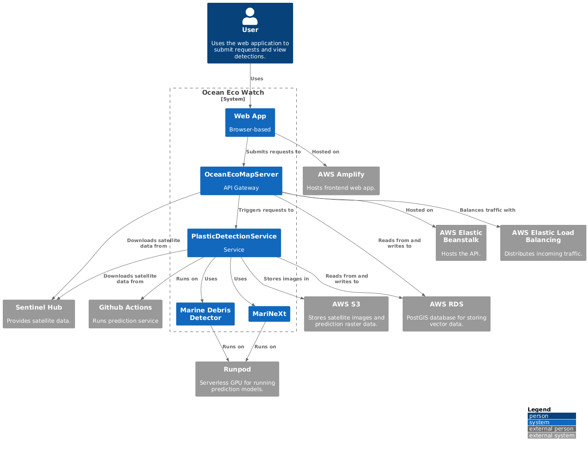

# Closing the marine pollution data gap

We are dedicated to leveraging satellite imagery to detect floating marine debris in coastal areas.

### By [2050](https://www3.weforum.org/docs/WEF_The_New_Plastics_Economy.pdf) there will be more plastic in the ocean than fish measured by weight!

Our mission is to support clean-up operations, research, and development by identifying and mapping marine debris, providing critical insights to combat this pressing challenge and foster a more sustainable relationship with our oceans.

## Collaborate

Curious about coastal pollution insights? We can provide you with a detailed analysis of any coastal region in the world from 2014 to the present. Whether you're seeking detailed analyses, have unique insights to share, are interested in contributing data, or are looking to explore partnership opportunities, we're happy to connect!
Contact us via contact@oceanecowatch.org

## Our Software

Our solution comprises three open-source subsystems:

### Plastic Detection Service

The plastic detection service forms the core of our project and enables the detection of floating plastic. To do this, we use satellite images, which are then analyzed by an AI model. Our method for identifying plastic is based on existing models that have been published in scientific publications.

Checkout our [cloud-based pipeline for detecting marine debris](https://github.com/OceanEcoWatch/PlasticDetectionService).

Checkout our [plastic detection model](https://github.com/OceanEcoWatch/PlasticDetectionModel).

### Making Data Available

Our backend system is designed for scalable, seamless integration between maps and the database, enabling efficient storage and retrieval of geolocated plastic debris information.

Checkout our [backend application](https://github.com/OceanEcoWatch/OceanEcoMapServer).

### Visualize It

Our frontend simplifies data understanding by visually mapping localized plastic, making it easier to grasp the problem at a glance.

Checkout our [frontend application](https://github.com/OceanEcoWatch/OceanEcoWatchMap).

## Prototype Fund

We are thrilled to announce that our project is part of [prototype fund round 15](https://prototypefund.de/en/project/ocean-eco-watch/). Prototype Fund supports us for the next six months. This funding will be used to refine our detection model and to develop an interactive map for visualizing marine debris.
